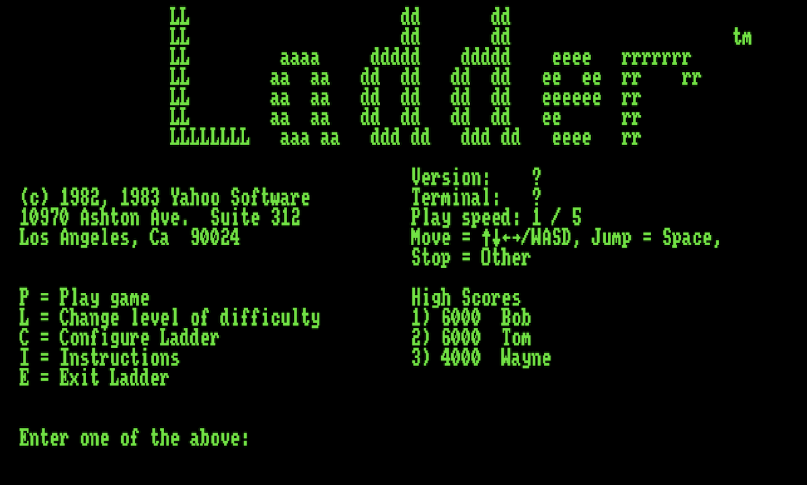
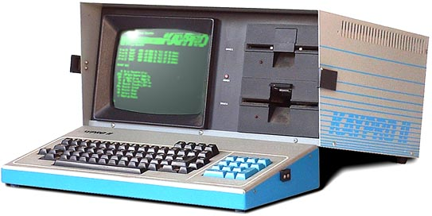

# ladderjs

> The 1982 CP/M game _Ladder_, ported to JavaScript and playable in your browser.

## What is Ladder?

When I was a kid, the first computer I got to play with was called the Kaypro II, and it looked just like this.

This thing had a single-color text-only screen, and no hard drive at all (you could only use programs loaded into memory from the two 5.25" floppy drives). The game Ladder was bundled with the Kaypro II and was inspired by the arcade game Donkey Kong, which had come out a year earlier in 1981.

Although it's not much to look at, the gameplay was solid. At the time I was still painstakingly typing in BASIC games from books I checked out of the library and hoping they would run, and a game that ran as fast and smooth as Ladder seemed like sorcery to me.

## Introducing ladderjs

Not only did I think it would be fun to play Ladder again, I thought it would be fun to implement it myself. Most of my amateur game development has been HTML5 games for the [js13kgames competition](https://js13kgames.com), so implementing Ladder in JavaScript/HTML5 seemed like a natural fit. It also lets people who have never seen or heard of it try it out immediately, so that's a bonus.

I'm not the first person to have this idea -- Stephen Ostermiller has been maintaining his [Java port](https://ostermiller.org/ladder/) for many years, and there's also an excellent [Turbo Pascal port](https://github.com/mecparts/Ladder), both of which I referenced heavily while creating my version.

One difference between the previous ports and `ladderjs` is that I wanted ladderjs to be _written the way you would write a JavaScript game today_. The way I handle the HTML5 canvas, keyboard events, and the basic update/draw game loop is essentially the same way I do in my annual js13k games, and the rest of the logic I've attempted to simplify and document as much as possible, so that an aspiring game developer can use it as a basis for their own games.

## Play it now

You can play ladderjs in your browser at [ladderjs.7tonshark.com](https://ladderjs.7tonshark.com).

## Changelog

| Version | Summary |
| --- | --- |
| v0.4.0 | Simple sound effects using the zzfx library. |
| v0.3.0 | Better air control (stop / change directions mid air), like original game. |
| v0.2.0 | Made available publicly at [ladderjs.7tonshark.com](https://ladderjs.7tonshark.com). |
| v0.1.0 | Initial, mostly-working game with all 7 original levels. |
